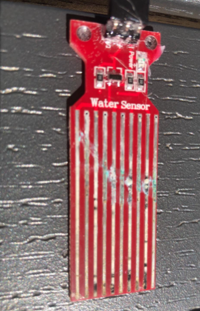
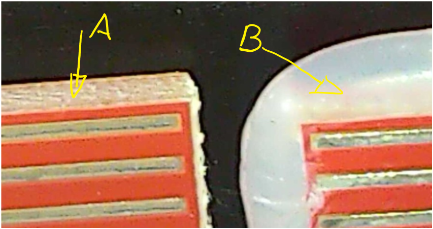
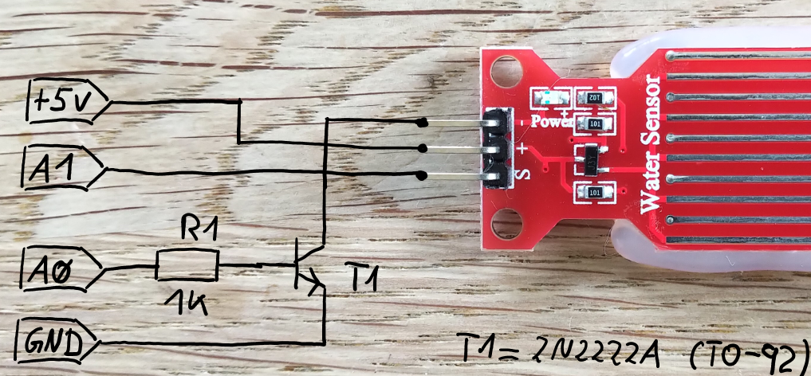
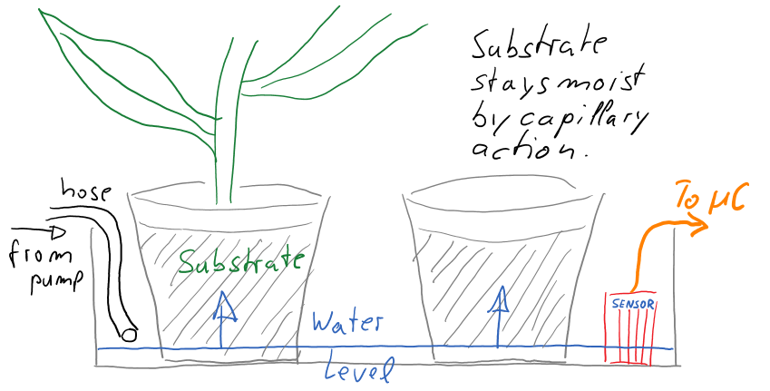

# Simple Water Sensor Library for Arduino (NANO, UNO, MEGA)

This project is about making very simple and cheap water sensors usable.

The problem with sensors of that kind is that they are destroyed if the sensor is
switched on and permanently in contact with water, moist soil or substrate.

A result can look like this:



To avoid this, three things are necessary:

 1) The sensor power is only switched on during measurement.
 2) Measure as short as possible.
 3) Measure as seldom as possible.

Requirement 1 and 2 are provided by this library. The third requirement is a question of design but
the library supports rare measurements. Here rare means less than or one times a second.

The water sensors supported by this library are very simple ones which use the conductivity of water. 
To work it is necessary that a current flows between the conducting path. If it is constantly in 
contact with wet soil, substrate or water, the sensor will "rotten" after a few days.
Due to the constant current flow, ions are deposited at the electrodes. If this happen you can see this at the conductor tracks.

**Example:** A moisture sensor for plants is switched on every hour to check moisture intensity. If moisture
is below threshold a pump is switched on for some seconds. After pump has stopped the next measurement
follows. If moisture is still to low the pump works on. This happens until moisture threshold is exceeded
or 5 iterations are counted, because 5 iterations looks like a fault.

I would like to make three observations. Worst case, best case and one measure per second:

**Worst case:** 24 times a day it measures 4 times because if 4 is exceeded 
the system goes in an error state and waits for user interaction. This
is done 365 times a year. To measure one value the sensor is switched on
for 120µs. This calculates to:

24 * 4 * 365d * 120µs = 4.20s/Year

This is below half a second a month. So if the sensor will "rot" normally
after some days when it is constantly switched on, in this mode it will
last for some years. This was the worst case.

**Best case:** Moisture is 23 times a day high enough and only one measure is
taken. The 24th measure is too low, pump starts and after one iteration
the substrate is wet enough. This calculates to:

(23 + 2) * 365d * 120µS = 1.095s/Year

**One measure per second**: If you plan to measure one time a second you will end up with:

60s * 60min * 24h * 365d * 120µS = 3784s

This is on hour a year.

## Set up the water sensor

First some facts to these type of sensor. When it is dry, a current of 3mA flows.
When the sensor is "wet" the value varies between 100mA and 170mA. It depends of the [EC](https://en.wikipedia.org/wiki/Electrical_resistivity_and_conductivity) the measured liquid has.
This is much current for a sensor and this is the reason why it is not possible to power the sensor
directly by a GPIO of the ATmega and why it rottens so fast if it is switched on an in contact with water.

I did the following measures.

EC [µS/cm] | I [mA] | Remark
-----------|--------|--------
0 | 3 | Sensor was dry
40 | 100 | Reverse osmosis water
800 | 110 | Tap water from Cologne
1650 | 140 | Water with nutrients
50000 | 170 | Sea water

If you water plants your values will be between a EC of 10 and 2400. A EC of 10 is rain water and a
EC of 2400 is water with nutrients for crops like tomatoes. So it is a good assumption to calculate
with 140mA per sensor.

This relatively high current must also be taken into account in the design of the power supply. With three sensors
a short current peak of 500mA will occur with each measurement. Depending on the power supply the VIN of the Arduino
should be buffered with a capacitor to avoid dips in the supply voltage.

### STEP 1

As you can see the material of the PCB is not protected against moisture at its edges.
I suggest to put some hot glue or other water protecting material around the part
of the sensor which is in contact with water.



**A**: without protection (as delivered) / **B**: with hot glue.

### STEP2

A NPN transistor as driver is required so that the sensor can be switched on before
the measurement and switched off immediately after the measurement.



* The +5V pin (VCC) of the Arduino is direct connected to the \"+\" pin of the Water Sensor.
* The A1 pin of the Arduino is connected to the \"S\" pin of the Water Sensor.
* Between the A0 pin of the Arduino and the T1 base R1 (1KOhm) is connected.
* The emitter of T1 is connected to GND of the Arduino.
* The collector of T1 is connected to the \"-\" pin of the Water Sensor.

 If A0 is switched to HIGH T1 switches and the \"-\" pin of the Water Sensor is connected 
 to ground and current can flow.

I use NPN Transistors of Type 2N2222A (TO-92) but many other NPN will work fine (BC337, BC517, ...).
You can use one driver for one sensor or one driver for many sensors. 

To use one driver for many sensors is simpler to set up. The trade-off is, that all sensors are switched on
if one measure is taken. So you need n times 140mA. Because of the short time of 120µs the sensor is switched on
it should not be a problem but depends on your use case and design.

One 2N2222A can drive up to 600mA. To stay safe I suggest not to switch more than 4 sensors.

For faster setup in the example I used one driver for many sensors. The power switch
is A0. To switch the power any other GPIO can be used, because A0 is set to output and
used like a digital pin. The ADC is not used.

For the \"S\" pins of the sensor a GPIO with ADC is recommended. In some designs it can
even work with a digital input but I suggest to use a analogue input.

### STEP 3

* Configure water_sensor.h to your needs.
* Compile the code and load it to your Arduino.
* See what happens.

In the example I set the threshold to 500. That means approx. 2.5Vdc at the output. If this
doesn't work lower the threshold to 250. Look at the readings on the console output.

The output should look like that:

    Serial ready
    1:  Sensor: 0 = wet Value = 546 Sensor: 1 = dry Value = 333 Sensor: 2 = dry Value = 483
    2:  Sensor: 0 = dry Value = 346 Sensor: 1 = dry Value = 342 Sensor: 2 = wet Value = 554
    3:  Sensor: 0 = dry Value = 416 Sensor: 1 = wet Value = 886 Sensor: 2 = wet Value = 725
    4:  Sensor: 0 = dry Value = 472 Sensor: 1 = wet Value = 887 Sensor: 2 = wet Value = 766
    5:  Sensor: 0 = wet Value = 500 Sensor: 1 = wet Value = 884 Sensor: 2 = wet Value = 766
    6:  Sensor: 0 = wet Value = 628 Sensor: 1 = wet Value = 840 Sensor: 2 = wet Value = 653
    7:  Sensor: 0 = dry Value = 431 Sensor: 1 = wet Value = 541 Sensor: 2 = wet Value = 635
    8:  Sensor: 0 = dry Value = 435 Sensor: 1 = wet Value = 760 Sensor: 2 = wet Value = 678
    9:  Sensor: 0 = dry Value = 440 Sensor: 1 = wet Value = 746 Sensor: 2 = wet Value = 674
    10:  Sensor: 0 = dry Value = 364 Sensor: 1 = dry Value = 289 Sensor: 2 = wet Value = 604
    11:  Sensor: 0 = dry Value = 354 Sensor: 1 = dry Value = 327 Sensor: 2 = wet Value = 593
    12:  Sensor: 0 = dry Value = 337 Sensor: 1 = dry Value = 302 Sensor: 2 = wet Value = 587

Sensor 0 and 2 are not connected so the ADC at A1 and A3 show random values. In line 3 sensor 1 was put in tap
water and in line 7 it was pulled out but need 3 seconds until it was below threshold.

## More description of the code/library

### The water_sensor.h file

The following lines can configured to your needs. It's good to configure the really used amount of 
sensors because any sensor configured uses memory if it is connected or not. The WTR_SNSR_MAXREADTIME 
tells the library how often it is possible to call waterSensorRead(). This is to avoid to much readings.
The fewer measurements the longer the sensor will work. I suggest to set this to 1000(ms) for safety and use
a code design which uses the sensor less than one times a second.

The enumeration of the waterSensors can be done as you like. Also { A, B, C } would work. But use the
same constants in the setup().

```C++
const int WATER_SENSORS = 3;
const int WTR_SNSR_MAXREADTIME = 1000;
enum waterSensors { WTR_SNSR1, WTR_SNSR2, WTR_SNSR3 };
```

The functions are easy to understand. waterSensorInit() shoul be called once in the setup() section of your main.cpp.
The first parameter is the waterSensor which is configured. The second takes the GPIO where the sensor "S" is connected 
to. This has to be a GPIO with ADC capabilities. The powerPin is the pin which is used to switch the sensor on.

```C++
// PUBLIC function declaration
void waterSensorInit(waterSensors sensor, int sensorPin, int powerPin);
int waterSensorRead(waterSensors sensor);
bool isDry(waterSensors sensor, int threshold);
```

### The water_sensor.cpp file

There is nothing special to this code. So let's only take a short look at some interesting lines.

```C++
01 digitalWrite(waterSensorArray[sensor].powerPin, HIGH);
02 value = analogRead(waterSensorArray[sensor].sensorPin);
03 digitalWrite(waterSensorArray[sensor].powerPin, LOW);
04 return value;
```

Even with this very short switch-on time, you can see how the LED of the sensor flashes very briefly and very faintly as soon as 
these lines are passed through.

In line one the power is switched on for the selected \[sensor\]. The analogue value of the sensor is read in line 02 and
in line 03 the power of the sensor is switched of. These 3 lines need approx. 120µs runtime. Where 100µs are used for the analogRead().
If you run through this code without interruption the sensor is switched on the most time. Therefore the code has a "break" built-in
which prevents calling it too often. Without break a ATmega8xx@16MHz can execute this code more than 4000 times a second while doing some
other things too. This means a "duty cycle" of 50% and the sensor is destroyd after a few days.

This is done in waterSensorRead()

```C
01 unsigned long ms;
02 if ((ms = millis()) > (waterSensorArray[sensor].t0 + WTR_SNSR_MAXREADTIME)) {
03     waterSensorArray[sensor].t0 = ms;
04     waterSensorArray[sensor].value = sensorValue(sensor);
05     return waterSensorArray[sensor].value;
06 } else {
07     return waterSensorArray[sensor].value;
08 }
```

In line 02 the code decides if the sensor is called or not. If the time since the last call is greater than WTR_SNSR_MAXREADTIME
the code is executed. Per default it is set to 1000ms which means 1s. But if waterSensorRead() is called more often than WTR_SNSR_MAXREADTIME
it uses the last read value. So be careful. If you set WTR_SENSR_MAXREADTIME to a large value, say 1 Hour, than the value you
read may be much too old to be useful.

## Restrictions

If the conductivity of the measured water is near zero the sensor would not work or show values near zero.
For tap water or moisture of soil it will work. Tests with water from a reverse osmosis system have indicated 
a value of 870 with a measured EC (G) of 40µS/cm.

There is no large difference in the readings if you put 10% or 90% of the sensor in the water. 
Thus the sensor is not suitable for displaying how much of the sensor is immersed.

## Use-case

I use these sensors only to measure "moisture" of "soil" to water indoor plants. In fact it is not possible to 
measure moisture with sensors of this working principle. Especially since "moist", "wet" or "dry" are not physical quantities.

With this sensor we measure whether the liquid has an EC (G) high enough for the sensor to indicate a value larger than zero.

For simple detection of "is wet" or "is dry" these sensors are good enough and they are very cheap.
I bought (FEB. 2021) 5 at Amazon (Germany) for 6 EUR. Older ones had a similar price (couldn't remember) and work just fine. At AliExpress I saw 5 pieces below 4 EUR.

I water my plants from "the bottom". So the substrate can suck water by capillary action. If the plant takes up water,
what means drying the substrate, the water from the bottom rises by capillary action until the water at the bottom is 
used up. Then the sensor comes into play and gives the signal to a pump to refill water.



The devices which irrigate the plants are small peristaltic pumps. They can pump up to 110ml per minute. 
The \"hose\" is a silicone tube and has an **inner** diameter of 3mm. This sounds like little but most plants have a daily requirement of less than 100ml.

If the plant is watered from below, the top layer is hardly moist and little water evaporates.

Why peristaltic pumps instead of centrifugal pumps?

* With centrifugal pumps it is difficult to dose, even with very small pumps. With this cheap and simple peristaltic pumps, you can dose to within a few ml.
* Perstaltic pumps are self-priming and the container with the liquid can be below the pump. Centrifugal pumps must be either below the liquid or immersed in it.
* Peristaltic pumps are tight when they are not pumping and no water runs out. With centrifugal pumps, it can happen that a siphon is built unintentionally and the tank with the supply water runs empty or the water from the container flows back to the pump.

Disadvantages of peristaltic pumps are:

* They are noisy. Not much but maybe there are people who mind.
* The pumps are not maintenance-free. The hose in the pump wears out and must be replaced.

 I do not know how often the hose has to be replaced.

## Ressources used

Water sensors from different sellers. This links where inserted on 06.06.2021:

[DollaTek](https://www.amazon.de/DollaTek-Wasserstandsensor-Fl%C3%BCssigwasser-Tr%C3%B6pfchen-Tiefenerkennungssensor/dp/B07DJ5FZ31/ref=sr_1_121?__mk_de_DE=%C3%85M%C3%85%C5%BD%C3%95%C3%91&dchild=1&keywords=wassersensor+az-delivery&qid=1622978060&sr=8-121)

[HALJIA](https://www.amazon.de/haljia-Wasser-Erkennung-Oberfl%C3%A4che-Arduino/dp/B06XQ496SW/ref=sr_1_9?__mk_de_DE=%C3%85M%C3%85%C5%BD%C3%95%C3%91&dchild=1&keywords=wassersensor+az-delivery&qid=1622978004&sr=8-9)

[MissBirdler](https://www.amazon.de/MissBirdler-F%C3%BCllstand-Sensor-Hygrometer-Raspberry/dp/B01MD1DQ3D/ref=sr_1_14?__mk_de_DE=%C3%85M%C3%85%C5%BD%C3%95%C3%91&dchild=1&keywords=wassersensor+az-delivery&qid=1622978004&sr=8-14)

[ARCELI](https://www.amazon.de/ARCELI-Wasserstandssensor-Fl%C3%BCssigkeit-Wassertropfen-Erkennung/dp/B07BP7B9TR/ref=sr_1_93?__mk_de_DE=%C3%85M%C3%85%C5%BD%C3%95%C3%91&dchild=1&keywords=wassersensor+az-delivery&qid=1622978036&sr=8-93)

How to document with markdown:
[Mastering Markdown](https://guides.github.com/features/mastering-markdown/)

## Major changes

Date       | Change
-----------|--------
2021-06-05 | waterSensorRead() implemented and limited sensor readings to one second by default. Documentation (REAME.md) started.
2021-05-27 | First working version as Library.
             Before this there were no Library and the functions were part of the main.cpp.